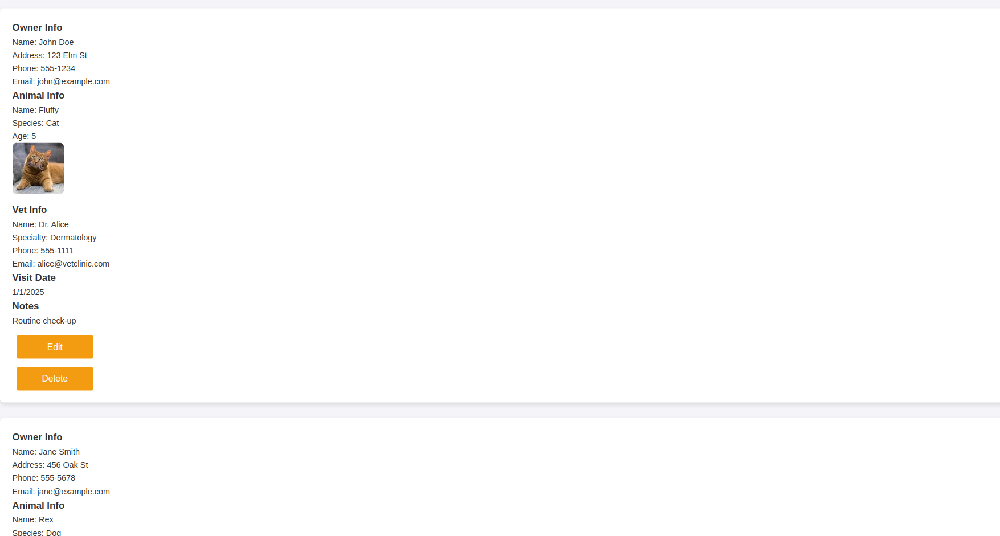

# Shopify-react-App

#### A simple web app that allows its users to keep track of list items they buy while shopping.

#### By **Emmanuel okoth**

## Description

This is  a web app that allows its users to keep track of list items they buy while shopping.
## Screenshot



## Features

- Add button so you can add shop item lists with their image and prices
- Up button so you can move it up the list
- Down button so you can move it down the list
- Delete button so you can delelte the item
- Timer so you can look at the time

## How to Use

### Requirements

- A computer, tablet, or phone
- Access to the internet
- A modern web browser

### View Live Site

Visit the deployed application at: [Shopify](https://superb-gelato-afbe79.netlify.app)

The live site allows you to:

- You can add shop item lists with their image and prices
- You can move it up the list
- You can move it down the list
- You can delelte the item
- YOu can look at the time

### Local Development

If you want to run the project locally, you'll need:

- Node.js installed on your computer
- Basic understanding of React JS
- Code editor (VS Code recommended)
- Terminal/Command Line

#### Installation Process

1. Clone this repository using:

   ```bash
   https://github.com/Manu88x/Project-react.git
   ```

   or by downloading a ZIP file of the code.

2. Navigate to the project directory:

   ```bash
   cd react-blog
   ```

3. Install the required dependencies:

   ```bash
   npm install
   ```

4. Run the development server:

   ```bash
   npm run dev
   ```

5. Open your browser and visit `http://localhost:5173`

## Technologies Used

- React JS
- Vite
- CSS
- JavaScript 

## Related Repositories

### Backend API

- Repository: [Shopify API Repository](https://github.com/Manu88x/Shop.git)
- Deployed API: [Live API URL](https://shop-617v.onrender.com)

## Support and Contact Details

If you have any questions, suggestions, or need assistance, please contact:

- Email: <Emmanuel.okoth@student.moringaschool.com>

## License

MIT License

Copyright &copy; 2024 Emmanuel okoth

Permission is hereby granted, free of charge, to any person obtaining a copy of this software and associated documentation files (the "Software"), to deal in the Software without restriction, including without limitation the rights to use, copy, modify, merge, publish, distribute, sublicense, and/or sell copies of the Software, and to permit persons to whom the Software is furnished to do so, subject to the following conditions:

The above copyright notice and this permission notice shall be included in all copies or substantial portions of the Software.

THE SOFTWARE IS PROVIDED "AS IS", WITHOUT WARRANTY OF ANY KIND, EXPRESS OR IMPLIED, INCLUDING BUT NOT LIMITED TO THE WARRANTIES OF MERCHANTABILITY, FITNESS FOR A PARTICULAR PURPOSE AND NONINFRINGEMENT. IN NO EVENT SHALL THE AUTHORS OR COPYRIGHT HOLDERS BE LIABLE FOR ANY CLAIM, DAMAGES OR OTHER LIABILITY, WHETHER IN AN ACTION OF CONTRACT, TORT OR OTHERWISE, ARISING FROM, OUT OF OR IN CONNECTION WITH THE SOFTWARE OR THE USE OR OTHER DEALINGS IN THE SOFTWARE.


# React + Vite

This template provides a minimal setup to get React working in Vite with HMR and some ESLint rules.

Currently, two official plugins are available:

- [@vitejs/plugin-react](https://github.com/vitejs/vite-plugin-react/blob/main/packages/plugin-react/README.md) uses [Babel](https://babeljs.io/) for Fast Refresh
- [@vitejs/plugin-react-swc](https://github.com/vitejs/vite-plugin-react-swc) uses [SWC](https://swc.rs/) for Fast Refresh


